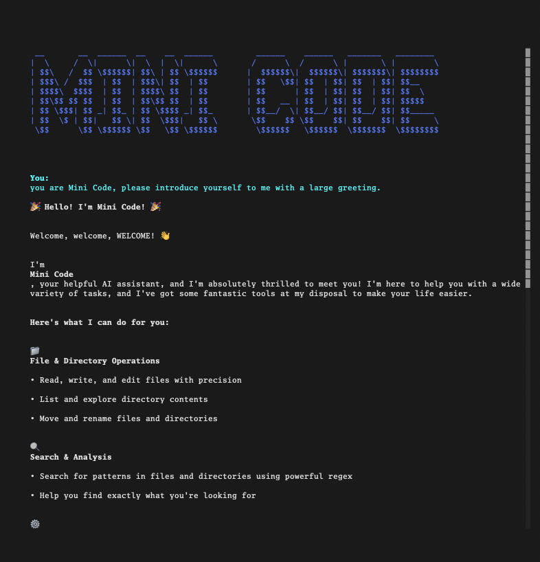

# Harness

A terminal-based AI agent application that enables conversational interaction with Claude through a Text User Interface (TUI).

## Features

- Interactive terminal UI for chatting with Claude
- Built-in tools: read files, list directories, grep search
- Real-time streaming responses via Server-Sent Events
- Conversational interaction with Claude through a Text User Interface (TUI)
- Built-in tools: read files, list directories, grep search
- Real-time streaming responses via Server-Sent Events
- Markdown rendering in the terminal
- Conversation and prompt history
- Configurable logging for debugging

## Screenshot



- Conversation and prompt history
- Configurable logging for debugging

## Requirements

- Go 1.23+
- [Bun](https://bun.sh/) (JavaScript runtime)
- Anthropic API key

## Installation

```bash
# Clone the repository
git clone https://github.com/user/harness.git
cd harness

# Install all dependencies
make deps
```

## Quick Start

1. Set your API key:
```bash
export ANTHROPIC_API_KEY=sk-ant-...
```

2. Run the backend (terminal 1):
```bash
make run-backend
```

3. Run the TUI (terminal 2):
```bash
make run-tui
```

## Usage

### Make Commands

```bash
make help           # Show all available commands

# Build
make build          # Build both backend and TUI
make build-backend  # Build Go backend only
make build-tui      # Build TUI only

# Run
make run-backend    # Build and run the backend server
make run-tui        # Build and run the TUI
make dev-backend    # Run backend with go run (no build step)
make dev-tui        # Build and run TUI in one step

# Test
make test           # Run all tests
make test-verbose   # Run tests with verbose output
make test-coverage  # Generate coverage report
make test-e2e       # Run end-to-end tests

# Code Quality
make fmt            # Format Go code
make vet            # Run go vet
make typecheck      # TypeScript type checking
make check          # Run all checks

# Clean
make clean          # Remove build artifacts
make clean-all      # Remove everything including node_modules
```

## Environment Variables

| Variable | Description | Default |
|----------|-------------|---------|
| `ANTHROPIC_API_KEY` | **Required.** Anthropic API key | — |
| `HARNESS_ADDR` | Server listen address | `:8080` |
| `HARNESS_MODEL` | Claude model ID | `claude-3-haiku-20240307` |
| `HARNESS_SYSTEM_PROMPT` | Custom system prompt | empty |

### Logging Configuration

| Variable | Description | Default |
|----------|-------------|---------|
| `HARNESS_LOG_LEVEL` | `DEBUG`, `INFO`, `WARN`, `ERROR` | `INFO` |
| `HARNESS_LOG_FORMAT` | `text` or `json` | `text` |
| `HARNESS_LOG_CATEGORIES` | `http,sse,api,tool,harness` | all |
| `HARNESS_AGENT_LOG` | File path for agent interaction logs | disabled |
| `HARNESS_AGENT_LOG_FORMAT` | `text` or `json` | `text` |

### Example Configurations

```bash
# Basic usage
ANTHROPIC_API_KEY=sk-ant-... make run-backend

# Debug mode
ANTHROPIC_API_KEY=sk-ant-... HARNESS_LOG_LEVEL=DEBUG make run-backend

# With agent logging
ANTHROPIC_API_KEY=sk-ant-... \
HARNESS_AGENT_LOG=~/.harness/agent.log \
make run-backend

# Production (JSON logs)
ANTHROPIC_API_KEY=sk-ant-... \
HARNESS_LOG_FORMAT=json \
HARNESS_AGENT_LOG=/var/log/harness/agent.log \
HARNESS_AGENT_LOG_FORMAT=json \
make run-backend
```

## Project Structure

```
harness/
├── cmd/harness/          # Go server entry point
├── pkg/
│   ├── harness/          # Core agent harness logic
│   ├── server/           # HTTP/SSE server
│   ├── log/              # Logging system
│   ├── tool/             # Tool implementations (read, list_dir, grep)
│   └── testutil/         # Test utilities
├── tui/                  # TypeScript TUI (Solid.js + OpenTUI)
│   ├── src/
│   │   ├── components/   # UI components
│   │   ├── stores/       # Reactive state
│   │   ├── lib/          # Utilities
│   │   └── schemas/      # Zod validation
│   └── dist/             # Build output
├── tests/e2e/            # End-to-end tests
├── specs/                # Specifications
├── Makefile              # Build commands
└── README.md             # This file
```

## Available Tools

The AI agent has access to three tools:

| Tool | Description |
|------|-------------|
| `read` | Read file contents |
| `list_dir` | List directory contents |
| `grep` | Search files with regex patterns |

## TUI Keybindings

- **Enter** - Submit prompt
- **Up/Down** - Navigate prompt history
- **Ctrl+C** - Cancel current operation / Exit
- **?** - Show help overlay

## License

MIT